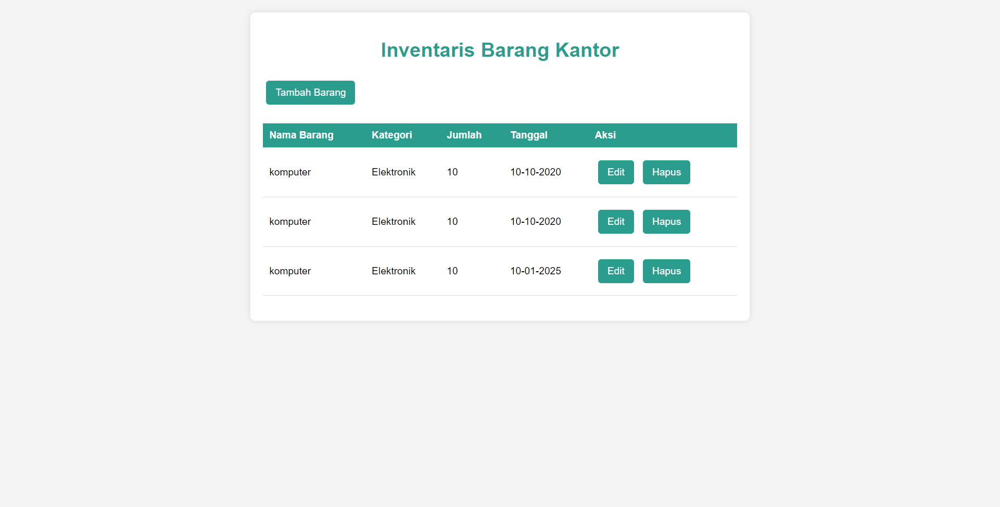

## Sistem Inventaris Kantor ##
- ### Deskripsi

Sistem Inventaris Kantor adalah aplikasi berbasis web yang dirancang untuk membantu pengelolaan dan pelacakan barang-barang di lingkungan kantor. Aplikasi ini memungkinkan pengguna untuk menambah, mengedit, dan menghapus data barang dengan mudah, serta melihat daftar inventaris yang tersedia. Dengan antarmuka yang sederhana dan intuitif, pengguna dapat dengan cepat mengakses informasi yang dibutuhkan mengenai barang yang ada di kantor.



- ## Fitur Utama
1. Tambah Barang: Pengguna dapat menambahkan barang baru ke dalam sistem dengan mengisi detail seperti nama barang, kategori, jumlah, tanggal, dan deskripsi.

2. Edit Barang: Pengguna dapat mengedit informasi barang yang sudah ada, termasuk mengubah nama, kategori, jumlah, tanggal, dan deskripsi.

3. Hapus Barang: Pengguna dapat menghapus barang dari sistem jika barang tersebut tidak lagi diperlukan.

4. Daftar Inventaris: Menampilkan daftar semua barang yang terdaftar dalam sistem beserta detailnya, termasuk nama, kategori, jumlah, tanggal, dan opsi untuk mengedit atau menghapus barang.

5. Responsif: Aplikasi ini dirancang untuk tampil dengan baik di berbagai perangkat, baik desktop maupun mobile.

- ## Teknologi yang digunakan
1. Frontend: HTML, CSS
2. Backend: PHP
3. Database: SQLite

- ## Instalasi

1. **Clone Repository**:
   bash
    ```git clone https://github.com/manramadhan/repository-name.git ```

- ## Cara Menggunakan

1. Menambah Barang: Klik tombol "Tambah Barang" di halaman inventaris untuk menambahkan barang baru.
2. Mengedit Barang: Klik tombol "Edit" di samping barang yang ingin diedit.
3. Menghapus Barang: Klik tombol "Hapus" dan konfirmasi untuk menghapus barang dari sistem.

- ## Lisensi
Projecy ini di selesaikan oleh firan


